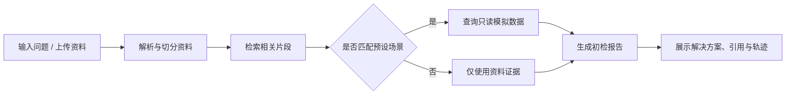

# CloudSight

> 面向云服务器与网络故障的知识库初检助手。支持上传临时资料、检索内置手册、查询只读模拟数据，并生成带资料来源的初检报告。


## Features

- 内置 8 类故障手册：CPU、磁盘、DNS、端口、Nginx、应用服务、网络延迟和 HTTPS 证书。
- 支持上传 PDF、TXT、Markdown 文件；资料仅在当前浏览器会话内参与检索。
- 优先使用中文语义检索；向量模型不可用时自动切换为关键词检索。
- 只读模拟诊断工具：服务状态、日志、网络与配置摘要均来自预设演示数据。
- 输出结构化初检报告：风险等级、可能原因、排查步骤、建议解决方案、资料来源和执行轨迹。
- 内置 8 个评测案例，用于检查资料引用与安全建议是否完整。

## Workflow



## Safety

CloudSight 是演示项目，不会连接阿里云、腾讯云或真实服务器，也不会执行系统命令。

- 模拟工具只读取 `data/scenarios.json` 中的预设数据。
- 涉及重启服务、修改生产配置或清理数据的建议，均要求人工确认。
- API 密钥只从本地环境变量或 Streamlit Secrets 读取，绝不提交到仓库。

## Quick Start

### 1. Create a virtual environment

```powershell
py -m venv .venv
.\.venv\Scripts\Activate.ps1
pip install -r requirements.txt
```

### 2. Configure the model interface (optional)

```powershell
Copy-Item .streamlit\secrets.toml.example .streamlit\secrets.toml
```

在 `.streamlit/secrets.toml` 中填写：

```toml
LLM_BASE_URL = "https://jojocode.com/v1"
LLM_API_KEY = "your-api-key"
LLM_MODEL = "gpt-5.6-terra"
```

未填写密钥时，应用仍可使用本地安全降级报告完成演示。

### 3. Run

```powershell
streamlit run app.py
```

打开 `http://localhost:8501`。

## Try It

1. 在侧边栏上传 [示例故障资料](examples/https_port_incident.md)。
2. 输入以下问题：

```text
HTTPS 网站连接超时，443 端口没有监听，Nginx 可能未启动。
```

3. 查看报告中的风险等级、建议解决方案、资料来源和执行轨迹。
4. 切换到“诊断评测”，运行 8 个预设案例。

## Project Structure

```text
.
├── app.py                    # Streamlit 页面入口
├── data/
│   ├── handbook/             # 8 份内置故障手册
│   └── scenarios.json        # 只读模拟场景数据
├── examples/                 # 可直接上传的示例资料
├── services/
│   ├── documents.py          # 资料解析与切分
│   ├── retrieval.py          # 中文语义/关键词检索
│   ├── tools.py              # 只读模拟诊断工具
│   ├── llm.py                # OpenAI 兼容接口调用
│   ├── orchestrator.py       # 诊断流程编排
│   └── evaluator.py          # 基础评测
└── tests/                    # 单元测试
```

## Test

```powershell
py -m unittest discover -s tests -v
```

当前包含 11 项单元测试，覆盖资料切分、模拟工具边界、报告引用、解决方案与评测逻辑。

## Deploy to Streamlit Community Cloud

1. 在 Streamlit Community Cloud 选择本仓库。
2. 入口文件填写 `app.py`。
3. 在应用的 **Secrets** 中填写 `LLM_BASE_URL`、`LLM_API_KEY`、`LLM_MODEL`。
4. 首次启动会下载中文检索模型；免费环境中建议保持上传资料较小。

## Notes

- `BAAI/bge-small-zh-v1.5` 与 FAISS 分别用于中文语义检索和相似资料查找。
- `gpt-5.6-terra` 通过 OpenAI 兼容接口生成报告。
- 本项目的目标是展示 Python、检索增强生成、工具调用与评测能力，不替代真实运维系统。
